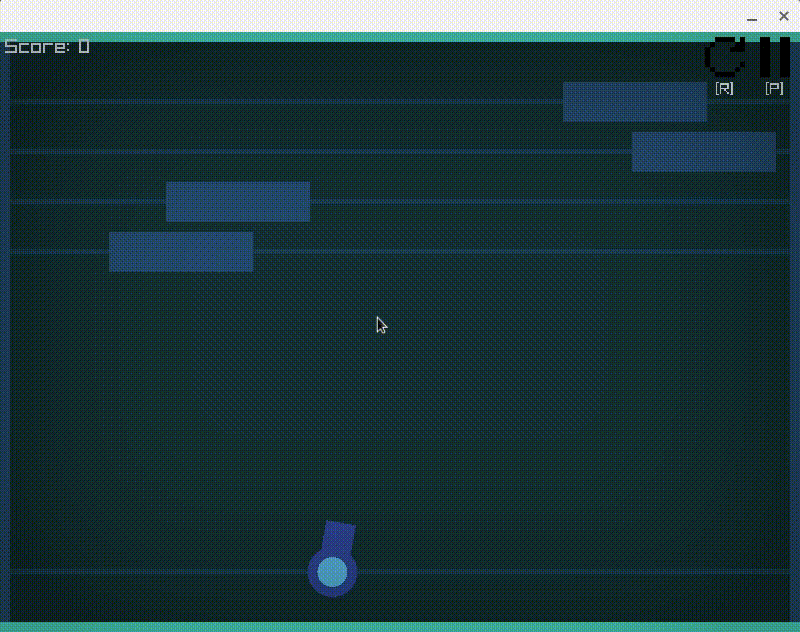

# Cannon Breakout

Atari-Breakout/Arkanoid but you are using a cannon instead of a paddle.\
Made with [Raylib](https://www.raylib.com/).

### How To Play

- Move cannon with A and D
- Aim with mouse
- Shoot with SPACE or Click
- Break all blocks to continue to the next level
- Blocks are getting faster after you completed a level (this game is endless BTW.)

### Previews



## Building Cannon Breakout

* VSCode
    1. [Install Raylib](https://github.com/raysan5/raylib/wiki)
    2. Open Folder in [VSCode](https://code.visualstudio.com/)
    3. Run "build debug/release" task
* Command line
    1. [Install Raylib](https://github.com/raysan5/raylib/wiki)
    2. Run
        ```
        make RAYLIB_PATH=/path/to/raylib OBJS=src/*.cpp

        # For debug mode
        make RAYLIB_PATH=/path/to/raylib OBJS=src/*.cpp BUILD_MODE=DEBUG
    
        # If you are using Shared library type
        make RAYLIB_PATH=/path/to/raylib OBJS=src/*.cpp RAYLIB_LIBTYPE=SHARED
        ```

Output is in the project folder.

Note: this game probably have many bugs.
